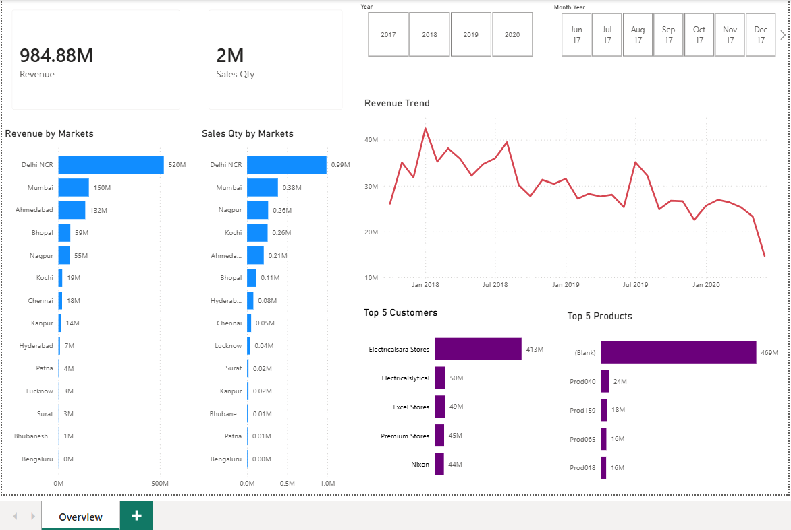
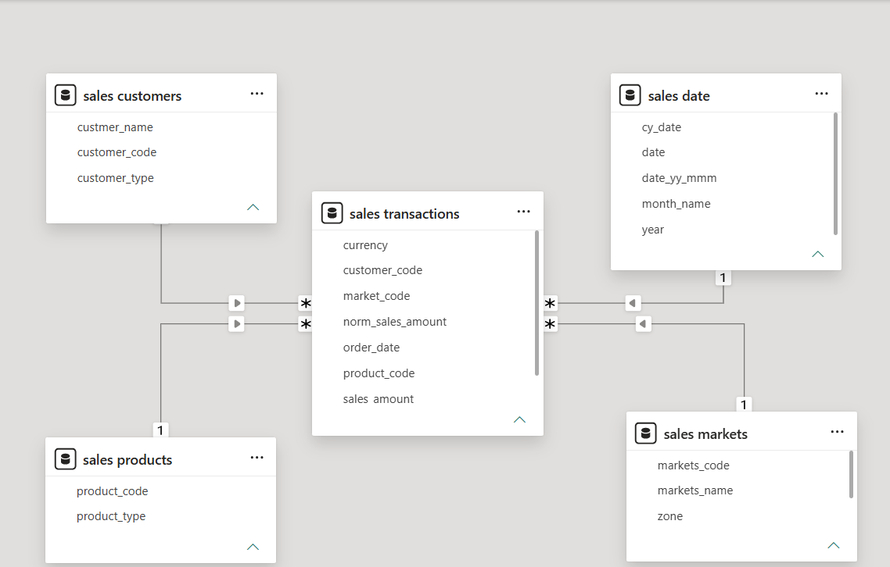
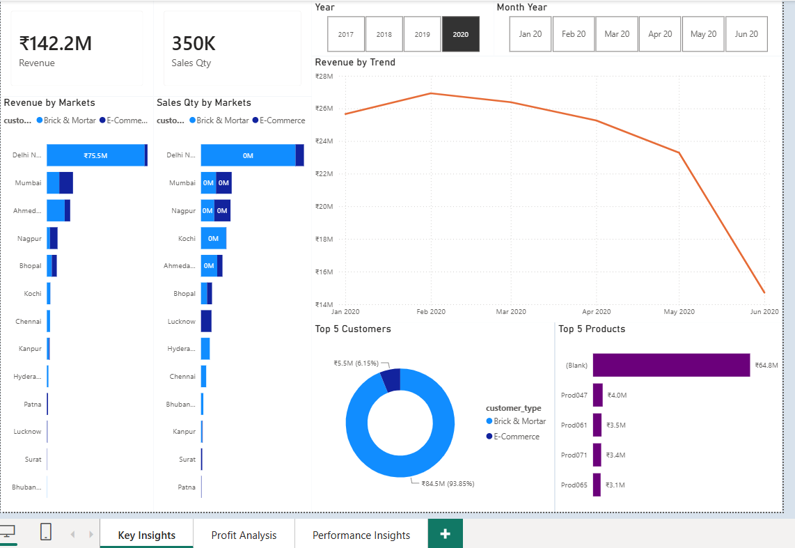
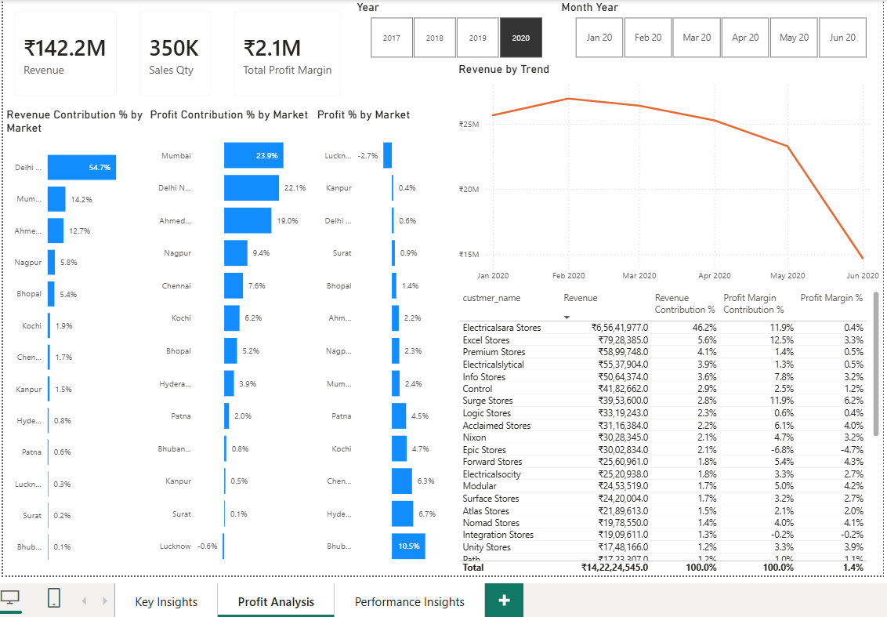
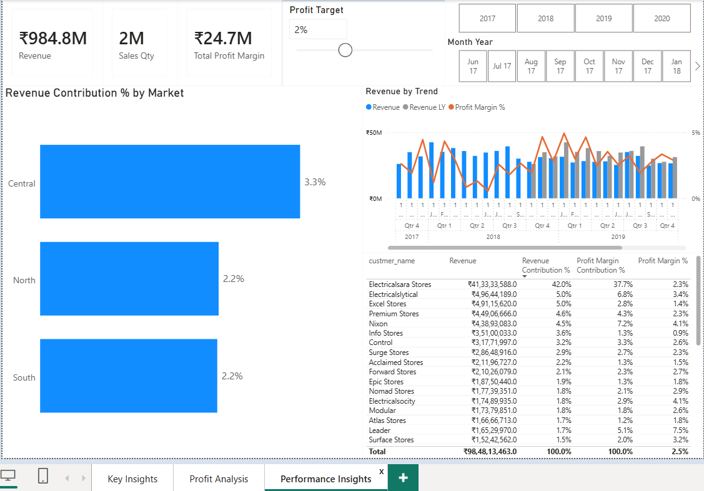

# Sales Performance Analytics
### End-to-End Business Intelligence Solution using SQL & Microsoft Power BI




---

# Business Problem

Businesses generate large volumes of sales transaction data every day. While this data contains valuable business information, raw relational tables are difficult to interpret and rarely provide actionable insights without further processing.

The objective of this project was to transform raw sales data into an interactive Business Intelligence solution capable of answering business questions such as:

- Which markets generate the highest revenue?
- Which customers contribute most to sales?
- Which products perform best?
- How has revenue changed over time?
- Which business segments are the most profitable?

The project demonstrates a complete analytics workflow beginning with SQL-based data exploration and ending with interactive Power BI dashboards for executive decision-making.

---

# Project Overview

This project follows a complete Business Intelligence pipeline.

Instead of directly creating dashboards from raw data, the workflow includes:

- SQL-based database exploration
- Data quality assessment
- Power Query ETL
- Data transformation
- Revenue normalization
- Star Schema data modeling
- DAX measure development
- Dashboard creation
- SQL validation of analytical results

The project was developed in two stages:

### Phase 1

Sales Performance Dashboard using the original transactional dataset.

### Phase 2

Enhanced Business Intelligence Dashboard introducing profitability analysis using an extended dataset containing:

- Cost Price
- Profit Margin
- Profit Margin Percentage

---

# Analytics Pipeline

```text
Raw Sales Database
        │
        ▼
SQL Exploration
        │
        ▼
Data Quality Assessment
        │
        ▼
Power Query ETL
        │
        ▼
Data Cleaning & Transformation
        │
        ▼
Star Schema Modeling
        │
        ▼
DAX Measures
        │
        ▼
Interactive Power BI Dashboards
        │
        ▼
Business Insights
```

---

# Dataset Overview

The project uses a relational sales database consisting of:

| Table        | Purpose                   |
|--------------|---------------------------|
| Customers    | Customer information      |
| Products     | Product information       |
| Markets      | Regional market details   |
| Date         | Calendar dimension        |
| Transactions | Sales transaction records |

The second version of the database extends the Transactions table by introducing profitability-related attributes for advanced business analysis.

---

# Data Quality Challenges

Before visualization, the raw transactional data required preprocessing to improve consistency and reporting accuracy.

Several issues were identified during analysis:

- Mixed currencies (INR and USD)
- Duplicate currency values caused by hidden carriage return characters
- Invalid sales values (`-1` and `0`)
- Non-business market records
- Revenue inconsistency due to multiple currencies

These issues prevented meaningful business reporting and therefore had to be addressed before dashboard development.

---

# Power Query ETL

Power Query was used to transform the raw dataset into an analysis-ready model.

The ETL process included:

### Data Cleaning

- Removed invalid sales transactions
- Filtered non-business market records
- Validated currency values
- Corrected data types

### Data Transformation

- Standardized currency records
- Converted USD transactions into INR
- Created the `norm_sales_amount` column
- Prepared the dataset for analytical reporting

These preprocessing steps ensured consistent revenue calculations across all dashboard visualizations.

---

# SQL Exploration

SQL was used to understand and validate the dataset before building the dashboards.

Key activities included:

- Exploring relational tables
- Record counting
- Market filtering
- Customer analysis
- Product analysis
- Revenue aggregation
- INNER JOIN operations
- Time-based sales analysis
- Currency investigation
- Data validation

Example business questions explored:

- Total revenue generated in 2020
- Revenue by market
- Products sold in specific markets
- Available currencies
- Transaction counts by region

---

# Data Model

The analytical model follows a **Star Schema**.



## Fact Table

- Transactions

## Dimension Tables

- Customers
- Products
- Markets
- Date

This dimensional model improves analytical performance while enabling flexible slicing across multiple business dimensions.

---

# Dashboard Evolution

The project was developed in two phases, with each phase expanding the analytical capabilities of the solution.

---

## Phase 1 – Sales Performance Dashboard

The first dashboard focuses on monitoring overall sales performance using the original transactional dataset.


### Key Features

- Revenue KPI
- Sales Quantity KPI
- Revenue Trend Analysis
- Revenue by Market
- Sales Quantity by Market
- Top Customers
- Top Products
- Interactive Year and Month filters

The primary objective of this dashboard is to provide an executive overview of business performance through intuitive visualizations and interactive filtering.

---

## Phase 2 – Enhanced Business Intelligence Dashboard

The second phase extends the project using an enhanced dataset containing profitability-related fields.

Additional columns include:

- Cost Price
- Profit Margin
- Profit Margin Percentage

These additions enable profitability analysis alongside traditional sales reporting.

The enhanced dashboard is divided into three analytical pages.

---

### Key Insights



Provides a high-level overview of business performance.

Features include:

- Revenue KPI
- Sales Quantity KPI
- Revenue Trend
- Customer Performance
- Product Performance
- Market Performance
- Interactive Filters

---

### Profit Analysis



Focuses on understanding business profitability.

Key metrics include:

- Total Profit Margin
- Profit Margin %
- Revenue Contribution %
- Profit Contribution %
- Customer Profitability
- Product Profitability

---

### Performance Insights



Designed for performance monitoring using advanced DAX calculations.

Features include:

- Revenue vs Previous Year
- Dynamic Profit Targets
- Target Difference Analysis
- Profit Margin Monitoring
- Year-over-Year Comparison

---

# DAX Implementation

Business calculations were implemented using DAX measures to support dynamic reporting and interactive analysis.

| Measure                      | Purpose                                                  |
|------------------------------|----------------------------------------------------------|
| Revenue                      | Calculates total revenue                                 |
| Sales Qty                    | Calculates total quantity sold                           |
| Total Profit Margin          | Calculates overall profit                                |
| Profit Margin %              | Calculates profitability relative to revenue             |
| Revenue Contribution %       | Calculates each entity's contribution to total revenue   |
| Profit Margin Contribution % | Calculates each entity's contribution to total profit    |
| Revenue LY                   | Calculates revenue for the previous year                 |
| Target Difference            | Compares actual profit margin with user-selected targets |

The project also implements a disconnected **Profit Target** parameter table to support dynamic performance analysis.

---

# Validation

To ensure analytical correctness, dashboard metrics were validated against SQL query results.

Validation included:

- Revenue aggregation
- Time-based revenue calculations
- Market-wise revenue analysis
- Transaction counts
- Currency verification

During validation, a discrepancy was identified where the dashboard referenced the original `sales_amount` column instead of the normalized revenue column.

The issue was corrected by updating the analytical model to use `normalize_sales_amount`, ensuring consistency between SQL results and dashboard calculations.

---

# Business Insights

The dashboards enable stakeholders to answer business questions such as:

- Which markets generate the highest revenue?
- Which customers contribute most to sales?
- Which products drive business growth?
- How has revenue changed over time?
- Which markets are highly profitable?
- Which customers contribute the greatest profit?
- How does current performance compare with previous years?
- Are profit targets being achieved?

By combining interactive filtering with dynamic KPI calculations, the dashboards support data-driven decision-making across multiple business dimensions.

---

# Technology Stack

| Category       | Technology         |
|----------------|--------------------|
| Database       | MySQL              |
| Query Language | SQL                |
| ETL            | Power Query        |
| Data Modeling  | Star Schema        |
| Analytics      | DAX                |
| Visualization  | Microsoft Power BI |

---

# Skills Demonstrated

### SQL

- Data exploration
- INNER JOIN operations
- Aggregations
- Filtering
- Business query development
- Data validation

### Power Query

- Data cleaning
- Data transformation
- Currency normalization
- Data type correction
- Calculated column creation

### Data Modeling

- Star Schema
- Fact and Dimension tables
- Relationship management

### Power BI

- Interactive dashboard development
- KPI design
- Visual analytics
- Slicers and filtering
- Business reporting

### DAX

- Measures
- Time Intelligence
- Dynamic KPIs
- Contribution analysis
- Parameter-driven calculations

---

# Repository Structure

```text
sales-performance-analytics/

├── dashboard/
│   ├── Sales_Overview.pbix
│   └── Sales_Performance_Analytics.pbix
│
├── screenshots/
│
├── sql/
│   ├── database/
│   └── queries/
│
└── README.md
```

---

# Future Improvements

Potential enhancements include:

- Automated data refresh
- Live database connectivity
- Sales forecasting
- Customer segmentation (RFM Analysis)
- Inventory analytics
- Executive scorecards
- Drill-through reports
- Row-Level Security (RLS)

---

# License

This project is licensed under the MIT License.

---

## Key Highlights

- End-to-End Business Intelligence Workflow
- SQL-Based Data Exploration
- Data Quality Assessment
- Power Query ETL Pipeline
- Currency Normalization
- Star Schema Data Modeling
- Advanced DAX Measures
- Interactive Power BI Dashboards
- SQL Validation of Dashboard Metrics
- Sales & Profitability Analysis

---